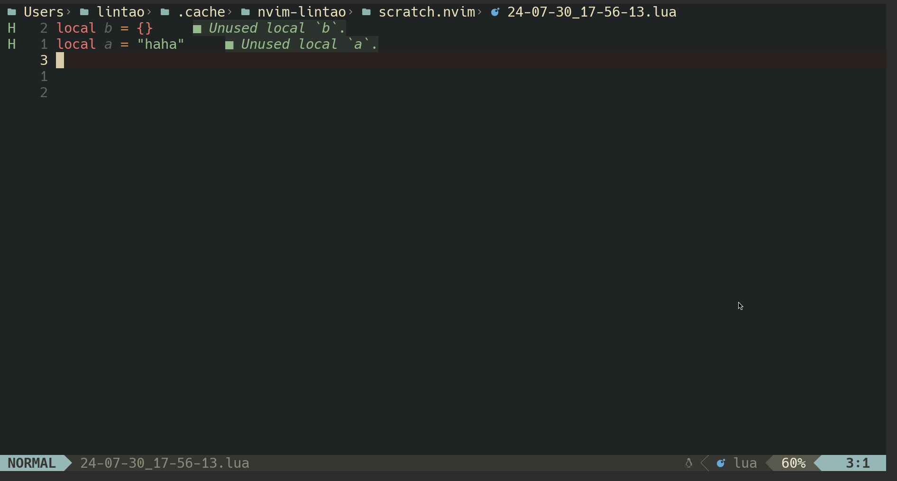

## 基本配置

以下是我的 LuaSnip 插件配置，包含了基本功能的设定和与 `nvim-cmp` 的集成。

```sh
lua
├── plugins
│   ├── init.lua
│   └── lang-core
│       └── snippet.lua # 配置 snippet 引擎
└── snippets
    └── lua_snippets # lua 配置的 snippets
        ├── lua.lua
        └── python.lua
```

<details>
<summary>lang-core/snippet.lua</summary>

```lua title="lang-core/snippet.lua"
return {
  {
    "L3MON4D3/LuaSnip",
    build = (not jit.os:find("Windows"))
        and "echo 'NOTE: jsregexp is optional, so not a big deal if it fails to build'; make install_jsregexp"
      or nil,
    dependencies = {
      {
        "rafamadriz/friendly-snippets",
        config = function()
          require("luasnip.loaders.from_vscode").lazy_load()
        end,
      },
      {
        "nvim-cmp",
        dependencies = {
          "saadparwaiz1/cmp_luasnip",
        },
        opts = function(_, opts)
          opts.snippet = {
            expand = function(args)
              require("luasnip").lsp_expand(args.body)
            end,
          }
          table.insert(opts.sources, { name = "luasnip" })
        end,
      },
    },
    opts = function(_, opts)
      local ls = require("luasnip")
      local types = require("luasnip.util.types")
      ls.setup({
        keep_roots = true,
        link_roots = true,
        link_children = true,
        update_events = "TextChanged,TextChangedI",
        delete_check_events = "TextChanged",
        ext_opts = {
          [types.choiceNode] = {
            active = {
              virt_text = { { "choiceNode", "Comment" } },
            },
          },
        },
        ext_base_prio = 300,
        ext_prio_increase = 1,
        enable_autosnippets = true,
        store_selection_keys = "<Tab>",
      })

      require("luasnip.loaders.from_lua").lazy_load({
        paths = { vim.fn.stdpath("config") .. "/lua/snippets/lua_snippets" },
      })

      require("luasnip.loaders.from_vscode").lazy_load({
        paths = { vim.fn.stdpath("config") .. "/lua/snippets" },
      })
    end,
    keys = {
      {
        "<tab>",
        function()
          return require("luasnip").jumpable(1) and "<Plug>luasnip-jump-next" or "<tab>"
        end,
        expr = true, silent = true, mode = "i",
      },
      { "<tab>", function() require("luasnip").jump(1) end, mode = "s" },
      { "<s-tab>", function() require("luasnip").jump(-1) end, mode = { "i", "s" } },
    },
  },
  { "chrisgrieser/nvim-scissors", dependencies = {
    "L3MON4D3/LuaSnip",
  } },
}
```

</details>

## 如何用 lua 编写 snippet

### 配置: 加载特定目录下面的 snippet

```lua title="lang-core/snippet.lua"
require("luasnip.loaders.from_lua").lazy_load({
    paths = { vim.fn.stdpath("config") .. "/lua/snippets/lua_snippets" },
})
```

1. **`require("luasnip.loaders.from_lua")`**：
   - 这个模块提供了一个方式来加载使用 Lua 格式编写的 Snippet。这表明你正准备通过 Lua 语言来定义自己的 Snippet，而不仅仅是依赖于已有的 Snippet 库。

2. **`.lazy_load({...})`**：
   - 这是一个用于延迟加载 Snippet 的方法。通过这种方式，在 Neovim 启动时不马上加载所有 Snippet，而是在使用它们的时候再进行加载。通过这种方式，可以加快文本编辑器的启动速度，同时确保在实际需要时才读入 Snippet。

3. **`paths` 字段**：
   - `paths` 属性是用来告诉 `luasnip` 从哪个目录加载 Snippet 的。具体到这段代码中：
     - `vim.fn.stdpath("config")`： 这个函数返回 Neovim 配置文件所在的标准路径（通常是 `~/.config/nvim`）。
     - `.. "/lua/snippets/lua_snippets"`：这是连接路径字符串，指向一个具体用于存放 Lua Snippet 的文件夹。也就是说，自定义的 Snippet 会位于 `~/.config/nvim/lua/snippets/lua_snippets` 目录下。

### Lua snippet 的示例

我用 lua 写 snippet 主要是它可以实现 postfix snippets.



```lua
local ls = require("luasnip")
local s = ls.s
local t = ls.t
local i = ls.i
local fmt = require("luasnip.extras.fmt").fmt
local rep = require("luasnip.extras").rep
local sn = ls.snippet_node
local d = ls.dynamic_node
local postfix = require("luasnip.extras.postfix").postfix

local append = postfix({
  trig = ".append",            -- 触发词
}, {
  d(1, function(_, parent)     -- 动态节点
    local matched = parent.snippet.env.POSTFIX_MATCH  -- 获取已输入的内容
    return sn(nil, fmt("table.insert({}, {})", { t({ matched }), i(1) }))  -- 返回新的 Snippet
  end),
})
```

- **`s` (Snippet)**：
  - `s(id, nodes)`：用于定义整个 Snippet 的节点。`id` 可以是 `nil` 或者是一个唯一标识符，`nodes` 是该 Snippet 包含的节点列表。这个节点是主节点，通常会由多个其他节点组成。

- **`t` (Text Node)**：
  - `t(nodes)`：表示文本节点，用于插入静态文本。这个节点不会被编辑，它只是用于展示定向的文本内容。例如，`t("Hello, World!")` 将简单地插入文本 `"Hello, World!"`。

- **`i` (Insert Node)**：
  - `i(pos)`：定义一个插入节点，允许用户在 Snippet 被扩展时在指定位置输入文本。`pos` 表示该插入节点的编号标识。如果有多个插入节点，可以为它们指定不同的编号，以便切换光标到相应位置。

- **`fmt` (Formatting) 方法**：
  - `fmt("template", { ... })`：这是一个辅助函数，用于格式化 Snippet 内容，使得在 Snippet 中插入多个值时更方便。使用模板字符串，其中的 `{}` 表示插入相应内容的占位符，可以与其他节点（如 `t`, `i` 等）配合使用。例如，`fmt("Hello, {name}, you are {age} years old", { t({name}), i(1) })` 是在指定位置插入用户输入的模板字符串。

- **`rep` (Repeat Node)**：
  - `rep(1)`：表示重复节点，允许用户在 Snippet 被扩展后重新输入以供后续使用。其参数是节点的编号，通过不断调用 `rep`，可以使得 Snippet 能够在用户需要重复某个片段时，提高代码的书写效率。

- **`sn` (Snippet Node)**：
  - `sn(nil, nodes)`：用于创建一个 Snippet 节点，`id` 设置为 `nil`（也可以为其他 ID）允许 Snippet 少数结构嵌套分解，能够更灵活地构建代码结构。

- **`d` (Dynamic Node)**：
  - `d(pos, func)`：定义了一个动态节点，其内容由给定的 `func` 函数动态生成，这个函数会在 Snippet 展开时被调用。参数 `pos` 决定此节点的编号。该节点的返回值可以包括多个不同的其他节点。这样，当用户输入 Snippet 的触发词时，动态节点的内容可以根据用户上下文或之前输入动态修改。

- **`postfix`**：
  - `postfix({ trig = "some.trigger", ... })`: 用于创建 postfix Snippet，触发词为用户在某个文本后加上指定后缀后的行为。在你的代码中，它用于定义一个名为 `.append` 的后缀 Snippet。一个此类节点通常允许用户在文本后追加一个特定功能。


#### 关键部分解释

1. **Postfix Snippet 概念**：
   - Postfix Snippet 是一种特殊类型的 Snippet，当用户在某段代码后添加指定的触发关键字时触发。在这里，触发词是 `.append`，这意味着用户将在某些文本后输入 `.append` 才会激活此 Snippet。

2. **`trig = ".append"`**：
   - 这表示当用户在文本后键入 `.append` 时，这个 Snippet 将被启用。

3. **`d(1, function(_, parent) ... end)`**：
   - `d` 代表一个动态节点。这个节点在 Snippet 被扩展时会执行指定的函数。
   - `1` 是这个动态节点的编号，方便程序内部管理多个节点。
   - `function(_, parent)` 是回调函数，其中 `parent` 代表 Snippet 的父级（也就是包含这个动态节点的 Snippet）。函数中 `matched` 变量将获取用于触发 Snippet 的已经输入文本，存储在 `parent.snippet.env.POSTFIX_MATCH` 中。

4. **`local matched = parent.snippet.env.POSTFIX_MATCH`**：
   - 通过 `parent` 获取到当前上下文中 `POSTFIX_MATCH` 变量的值，`matched` 代表用户在输入触发文本时已经输入的内容。

5. **`return sn(nil, fmt("table.insert({}, {})", { t({ matched }), i(1) }))`**：
   - `sn(nil, ...)`：创建一个新的 Snippet 节点，`nil` 表示没有特定的 UID。
   - `fmt("table.insert({}, {})", { t({ matched }), i(1) })`：使用 `fmt` 函数构建 Snippet 的内容，生成一个格式化字符串：
     - `table.insert({}, {})` 是 Lua 中用来将元素插入表（数组）的常用函数。
     - `t({ matched })` 将把 `matched` 作为文本节点插入到第一个位置 `{}`。
     - `i(1)` 将会在第二个 `{}` 位置创建一个插入节点，让用户在这里输入要插入到表中的新元素。


