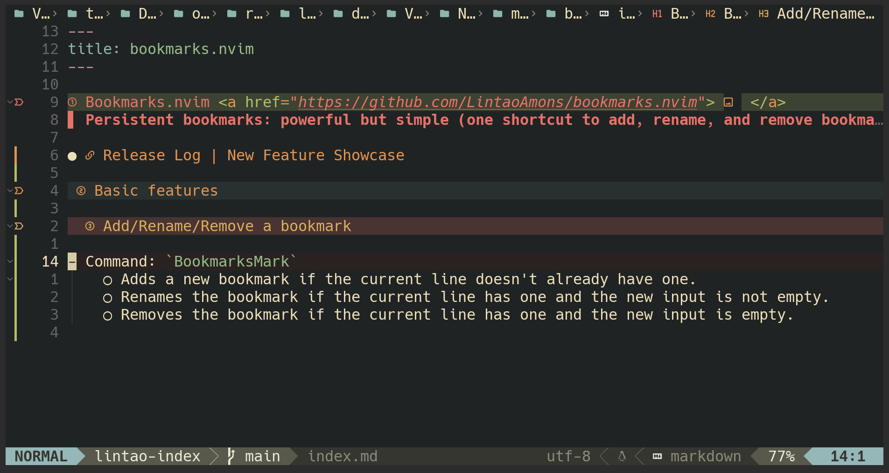

# Bookmarks.nvim 

> Persistent bookmarks: powerful but simple (one shortcut to add, rename, and remove bookmark)
>
> [Release Log | New Feature Showcase](./release-log.md)

- Simple: Add, Rename and Remove mark with only one command, less shortcuts more productivity
- Persistent: save your bookmarks into a human reable json file, which you can manipulate munally
- Accessible: Find your bookmark by telescope or Treeview with ease
- Informative: mark with a description, so you can record more information
- Visibility: display icon and name at the marked lines, and highlight marked lines
- Groups: arrange your bookmarks in groups, so keep you away from noises
- Portable: Share you bookmarks with others/or your another device by simple changing the project path in the json file

## Basic features

### Add/Rename/Remove a bookmark

- Command: `BookmarksMark`
  - Adds a new bookmark if the current line doesn't already have one.
  - Renames the bookmark if the current line has one and the new input is not empty.
  - Removes the bookmark if the current line has one and the new input is empty.

