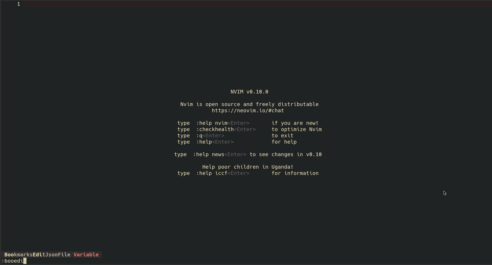

# Release log

## v1.2.0-treeview


<details>
<summary>Config</summary>

```lua
require("bookmarks").setup({
  -- highlight-next-line
  treeview = {
    bookmark_format = function(bookmark)
      return bookmark.name
        .. " ["
        .. bookmark.location.project_name
        .. "] "
        .. bookmark.location.relative_path
        .. " : "
        .. bookmark.content
    end,
    keymap = {
      quit = { "q", "<ESC>" },
      refresh = "R",
      create_folder = "a",
      tree_cut = "x",
      tree_paste = "p",
      collapse = "o",
      delete = "d",
      active = "s",
      copy = "c",
    },
  },
  -- ...
})
```

</details>


## v1.1.0-line-highlight-and-db-backup

### Line Hightlight

Now you can set a highlight backgound color at your marked line


<details>
<summary>Config</summary>

```lua
require("bookmarks").setup({
  json_db_path = vim.fn.stdpath("data") .. "/bookmarks.db.json",
  signs = {
    mark = {
      icon = "󰃁",
      color = "red",
      -- highlight-next-line
      line_bg = "blue",
    },
  },
})
```

</details>

### Backup DB json file

In case of data lose, we init this backup function

Right now it's simply save a backup file at the same location at the same folder of your db json file



<details>
<summary>Config</summary>

```lua
require("bookmarks").setup({
  json_db_path = vim.fn.stdpath("data") .. "/bookmarks.db.json",
  -- highlight-next-line
  enable_backup = true,
})
```

</details>
