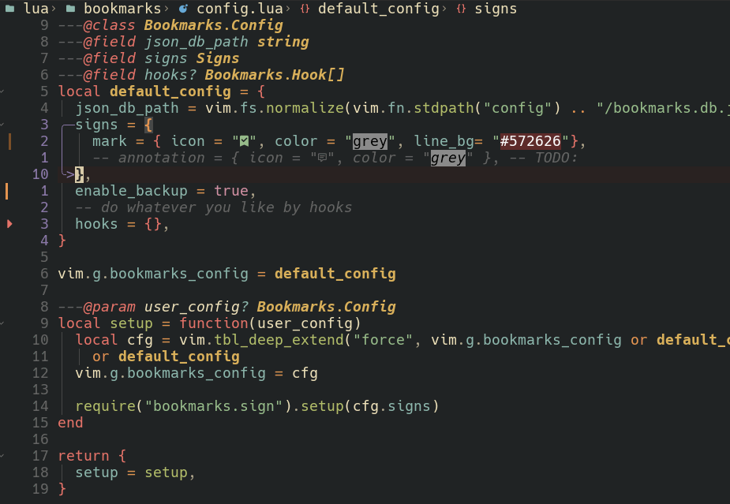

# Release log

## v1.1.0-line-highlight-and-db-backup

### Line Hightlight

Now you can set a highlight backgound color at your marked line



<details>
<summary>Config</summary>

```lua
require("bookmarks").setup({
  json_db_path = vim.fn.stdpath("data") .. "/bookmarks.db.json",
  signs = {
    mark = {
      icon = "󰃁",
      color = "red",
      -- highlight-next-line
      line_bg = "blue",
    },
  },
})
```

</details>

### backup DB json file

In case of data lose, we init this backup function

Right now it's simply save a backup file at the same location at the same folder of your db json file


<details>
<summary>Config</summary>

```lua
require("bookmarks").setup({
  json_db_path = vim.fn.stdpath("data") .. "/bookmarks.db.json",
  -- highlight-next-line
  enable_backup = true,
})
```

</details>
