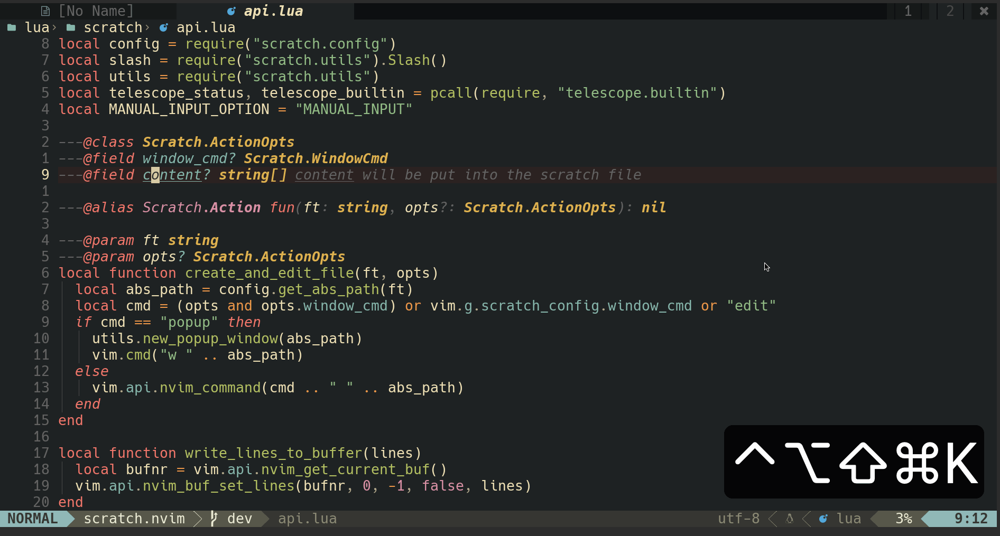
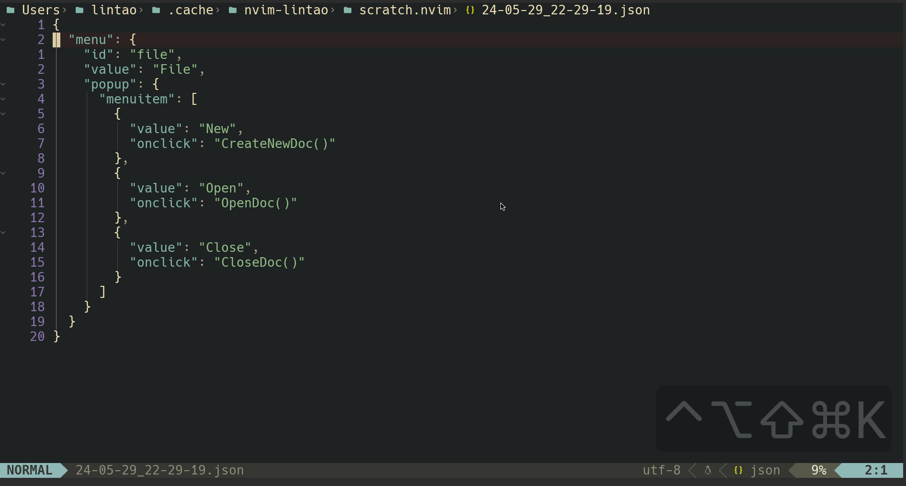
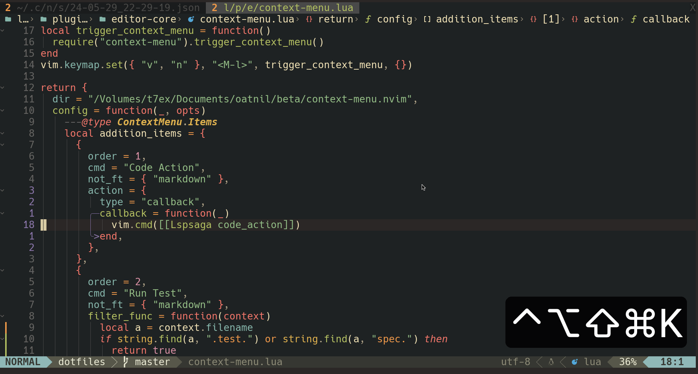
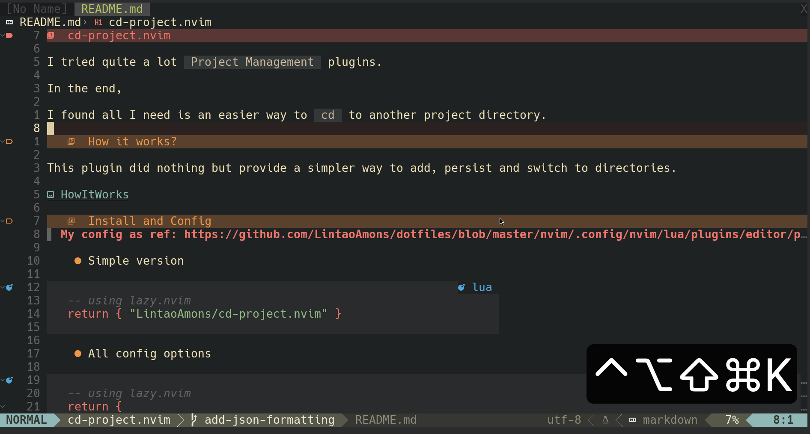
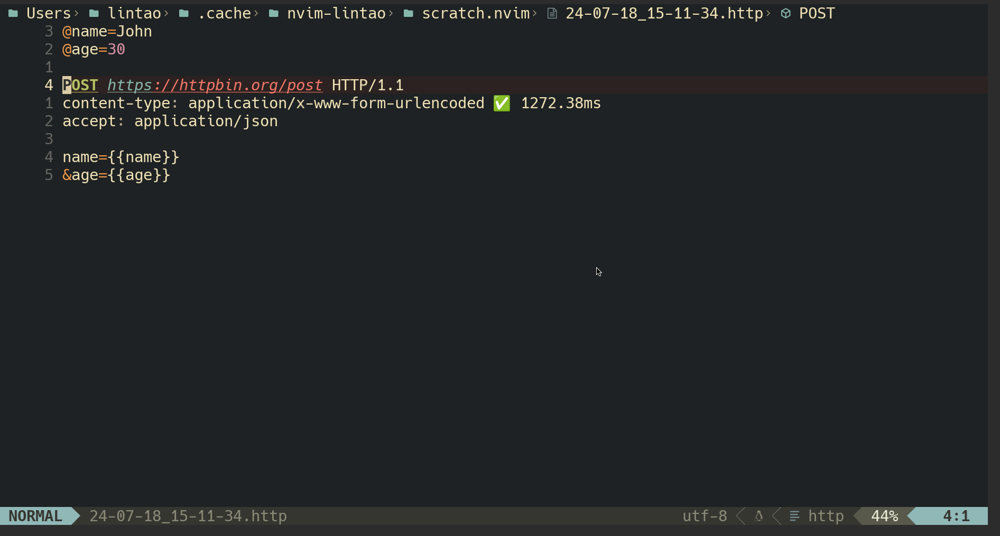

# Context-Menu.nvim  

## Philosophy

- Minimise the cognitive overload in the head, but still put every functionality around you hand
- Less keybindings but remian productivity
- Configuration can be put in seperated spec files, and behaviour can be config at runtime and take effect immediately

## Usecases

### Git
> [config ref](https://github.com/LintaoAmons/CoolStuffes/blob/main/nvim/.config/nvim/lua/plugins/git/gitsign.lua)

### Json | Jq
> [config ref](https://github.com/LintaoAmons/CoolStuffes/blob/main/nvim/.config/nvim/lua/plugins/lang/json.lua)

### Copy
> [config ref](https://github.com/LintaoAmons/CoolStuffes/blob/main/nvim/.config/nvim/lua/plugins/editor-enhance/copy.lua)

### Markdown
> [config ref](https://github.com/LintaoAmons/CoolStuffes/blob/0f69158b06fdae18a9da684f3cff756e72d9e958/nvim/.config/nvim/lua/plugins/lang/markdown.lua#L4)

### HTTP

