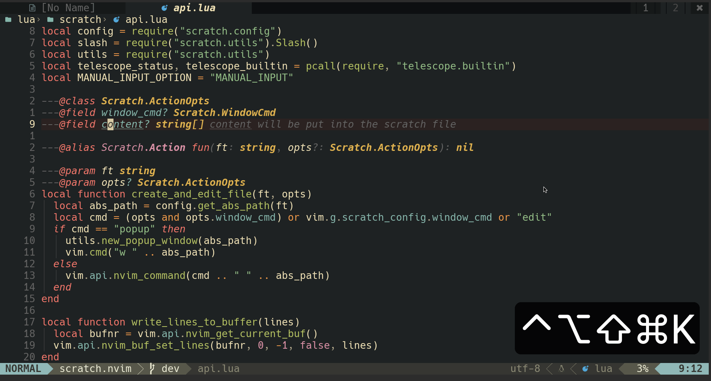

# Context-Menu.nvim
> check the [github](https://github.com/LintaoAmons/context-menu.nvim) repo
>
> 

## Usecases

### Git
> [config ref](https://github.com/LintaoAmons/CoolStuffes/blob/main/nvim/.config/nvim/lua/plugins/git/gitsign.lua)

